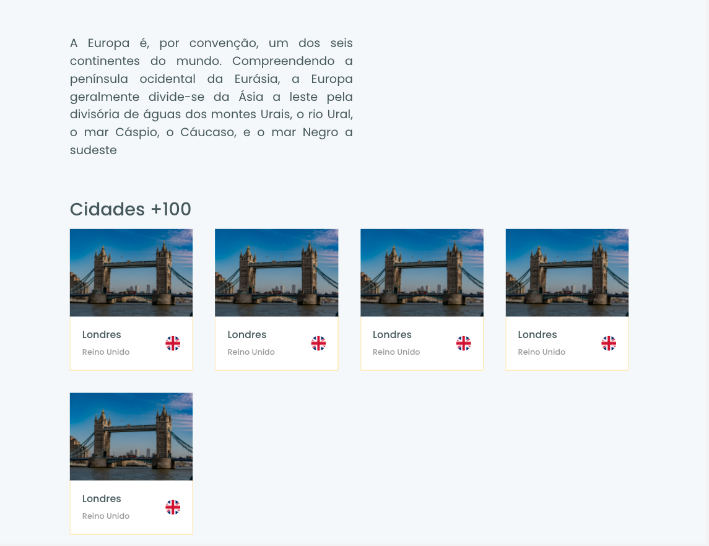

# ignite-worldtrip-nextjs ✈️
 
Iniciar uma aplicação Next.js do zero, utilizando a interface conforme o layout do Figma. Desenvolver toda a interface usando como base o Chakra UI. Trabalhar na responsividade da aplicação. 
## Tecnologias 💻

Next.JS
SCSS
Chakra UI
Swiper
Figma
Modelo responsivo

## Layout Mobile e Desktop 

      
      
      
      
  
      
      

